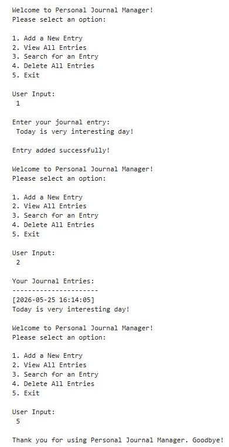

# 🚀 Python File Operator

A beginner-friendly Python project focused on file handling and journal management concepts.

## 📌 About This Project
This repository contains:
- Python file handling programs
- Read and write file operations
- Personal Journal Manager project
- Beginner-friendly coding exercises
- AI/ML preparation content

## 📂 Files Included
- `PR.6_File_Operator.ipynb` → Jupyter Notebook containing file handling programs
- `PR.6_File_Operator.png` → Output screenshot of the Personal Journal Manager project

## 🛠 Technologies Used
- Python
- Jupyter Notebook

## 🎯 Learning Goals
This project helps in understanding:
- File handling in Python
- Read and write operations
- Data storage concepts
- Logical problem-solving using Python

## 📸 Project Output

## 👨‍💻 Author
**Yashraj Sharma**

---
⭐ If you like this project, don't forget to star the repository.
